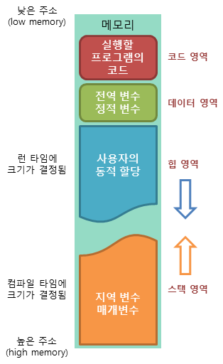

# 포인터란?

메모리 주소를 값으로 갖는 타입.

  
여러 포인터는 하나의 변수를 가리킬 수 있다.  
포인터 변수에 담기는 값은 64bit OS는 8byte, 32bit는 4byte 길이의 16진수 주소값이 담김

## 선언 방식

  ```go
  var a int = 10  // int32 (8bit) 사이즈의 메모리 주소 a에 10 대입
  var p *int      // 8bit 사이즈를 갖는 메모리 주소를 할당받을 수 있는 포인터 변수

  p = &a          // &은 메모리 주소값. 동일 메모리 사이즈를 갖는 a 메모리 주소를 p에 값으로 할당

  fmt.Println(p)  // 0x..... 같은 메모리 주소반환
  fmt.Println(*p) // p에 할당된 메모리 주소의 값인 10을 반환

  *p = 20             // a 메모리 주소의 값을 20으로 대입
  fmt.Println(a, *p)  // 실제로 둘 다 a 메모리 주소의 값을 반환하는것이기에 20, 20 반환

  // 구조체 포인터 초기화 방식 1
  var data Data
  var b *Data = &data   // &data는 앞서 선언된 data 변수의 주소를 대입

  // 구조체 포인터 초기화 방식 2, 3
  var c *data = &Data{} // Data 구조체를 새로 만들고 그 주소를 대입
  d := &Data{}          // 좀 더 짧게. {} 니까 초기값 선언 가능

  // 구조체 포인터 초기화 방식 4
  var e = New(Data)     // New로 기본값이 할당된 구조체를 할당
  // New 로 초기화 하는것은 초기값을 선언하지 않는 경우에만 활용함

  ```

## 사용 목적

불필요한 메모리 점유를 없애기 위해 활용하며 가장 최적화된 활용처는 함수임.  
함수의 파라메터는 항상 대입으로 동작하며, 입력에 대한 리턴값을 제공하는것이 목적이기 때문.

1. 변수에 데이터를 대입하는 경우,  
   다른 메모리에 저장된 같은 사이즈 내 저장된 값을 복사 후 쓰는 형태로 동작.  

2. 대입을 위한 입력 사이즈가 크면,  
   단순 대입을 위해 동일 사이즈 메모리를 또 할당해야 하기에 리소스 손해가 발생함.

```go
  // 포인터 없이 구조체의 데이터를 변경하는 함수
  // 예시 자료형, 메모리 점유 사이즈 1608bit
  type Data struct {
    value int       // 8bit
    data [200] int  // 1600bit
  }
  
  func ChageData(arg Data) Data {
    arg.value = 999
    arg.data[2] = 999
    return arg
  }

  var data Data            // 1608bit mem var
  data2 := ChageData(data) // 1608bit 를 점유하는 또 다른 변수를 생성하고
  data = data2             // data2 의 데이터를 data에 복사.

  // data2 는 그저 보유 값 복제를 위해 잠시 사용됐고 메모리 낭비가 존재
```

```go
  // 포인터로 구조체의 데이터를 변경하는 함수
  var data Data                 // 1608bit mem var
  func ChangeData2(arg *Data) { // arg는 입력된 메모리 주소에 저장된 실제 값이 됨 
    arg.Value = 999
    arg.data[2] = 999           // 실제 값이 바뀜
  }
  ChangeData2(&data)            // 수정할 데이터의 메모리 주소를 기입.
  

```

## 인스턴스란?

인스턴스는 실제 메모리를 점유하는 데이터를 의미.  
즉, 포인터가 가리키는 메모리 주소 대상이 하나의 인스턴스를 의미함.  


  

모든 변수는 각자 고유한 메모리 주소와 함께 값이 할당 되어 있는 구조.  
아래 사진과 같이 var data1 Data 의 값을 다른 변수에 대입하는 것은 복제이기에 때문에, 이 경우 고유 메모리 공간을 점유하는 인스턴스는 3개임

  

### Escape Analysis (탈출 분석) - Feat,변수가 저장되는 메모리 (힙, 스택)

  
일반적으로 함수 또는 중괄호 내 지역변수는 Stack 메모리에 쌓이며 이 블럭을 벗어나면 삭제됨.  

  
Go는 컴파일 단계에서 지역변수를 리턴 해 함수 밖에서 활용하게 되는 구조로 확인되면 Stack 메모리가 아닌 Heap 메모리에 할당하는 최적화 기술이 내장됨.

```go
  // Go 에서만 가능한 구조.
  // 블럭 내 선언한 인스턴스를 메모리 주소로 리턴하고 타입을 값으로 반환하는 형태.
  func NewInMemoryPlayerStore() *InMemoryPlayerStore {
    return &InMemoryPlayerStore{map[string]int{}}
  }
```

### 인스턴스의 생명 주기 이해하기

변수: 선언된 중괄호를 벗어나면 삭제. (스택 메모리)
인스턴스: 포인팅 되지 않은 상태 (활용되지 않는 상태) 로 확인되면 GC(Garvege Collector) 가 힙 메모리에서 제거함

```go
  // 본 함수가 끝나면 u변수는 제거되나 인스턴스인 User{} 는 남아있음
  type User struct {
    name string
    age int
  }
  
  // Go 에서만 가능한 구조.
  func NewUser(name string, age int) *User {  // Return 될 값의 메모리 주소는 함수 내 지역 변수임.
    var user = User{name, age}                // 일반적인 경우 함수가 끝나면 삭제됨
    return &user                              // user 변수의 메모리 주소를 반환 선언 (Go만 가능)
  }

  func main() {
    userPointer := NewUser("AAA", 11)         // 반환된 메모리 주소의 값을  변수에 담았음을 확인하여 컴파일 단계에서 힙 메모리로 전환
    fmt.Println(userPointer)                  //값 반환
  }
  
```
