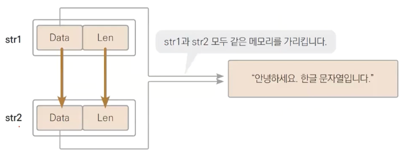

# 문자열

문자열은 rune (alias int32) 타입으로 이뤄진 하나의 배열을 말함.  
별도 길이를 선언하지 않고 활용한다.

```go
    // 변수 선언
    t1 := "쌍따옴표로 묶이며 개행문자를 인식함 \n"       // 마지막 줄 엔터
    t2 := `두줄 이상의 문자열을 그대로 담을때 사용합니다.
    \n 같은 개행문자는 호환되지 않아요`
```

## 특징

1. Go는 기본적으로 UTF-8 포맷으로 문자 데이터를 처리하며 이는 4Byte임 (int32 사이즈).  

2. 대부분의 문자는 1byte 로 데이터를 처리할 수 있어 ASCII 로 대부분의 문자열을 처리할 수 있고, 특수문자나 한글은 2byte 로 처리함

3. ***문자열 len() 함수는 문자열을 이루는 총 바이트 길이를 나타 냄***

    ```go
        t1 := "ABC"                                 // ASCII 로 호환되는 데이터만
        fmt.Println(t1[0], t1[1], t1[2])            // 65 66 67 (ascii 출력)
        fmt.Println(len(t1))                        // 바이트의 길이 반환. (3 출력)

        t2 := "ABC얍"                               // 한글 포함
        fmt.Println(len(t2))                        // 길이 6 (3 + 2 + 2)
        fmt.Println(t2[3]), len(t2))                // 셋째 자리는 "얍"이 아님, 한글은 2Byte라 rune 타입으로 의도된 정보를 반환할 수 없음
    ```

4. 문자열 조건식

    문자열은 실제로 바이트가 담긴 데이터이며, UTF-8 구조에 의해 아래와 같이 동작함  

    ```go
        s1 := "ABC"
        s2 := "DEF"

        fmt.Println(s1 == s2) // false, 각 자리 ascii 넘버가 표현되는 숫자가 다름
        fmt.Println(s1 != s2) // true

        
        fmt.Println(s1 < s2)    // true, D가 A 보다 큰 ascii 값을 가짐.

        // true를 반환하기 위해서는 좌변에 대한 비교군의 모든 데이터가 AND 로 true 를 반환해야 함
        fmt.Println("ABC" < "C") // true
        fmt.Println(s1 < "ABB") // false, 앞 자리가 같지만 마지막 C 가 더 큼

    ```

## 문자열 구조
문자열 변수는 메모리에 저장된 데이터의 메모리의 주소와 (포인터) 데이터의 길이값만 담고 있는 구조임.  

  

즉, 문자열 변수의 대입은 실제 데이터의 메모리 주소와 길이 값만 대입하는 형태.  

```go

    // 대입은 기본적으로 사이즈가 같은 데이터 끼리만 가능한데 string은 따로 길이를 선언하지 않음

    var s1 string = "Hi" // 문자열 선언
    var s2 string

    s2 = s1 // s2에 s1을 대입

    fmt.Println((unsafe.StringData(s1)))
    fmt.Println((unsafe.StringData(s2)))    // 두 메모리 주소가 같음

```

### 문자열의 불변성

문자열은 구성하는 데이터의 일부를 변경할 수 없다.  
데이터 변경은 무조건 같은 string 타입 전체를 바꾸어야 한다. 이는 string 타입 자체가 포인터와 길이 정보만 갖는 놈이기 때문이기도 함

문자열 변수는 메모리 주소를 갖고 있지만, 특성 상 불변성을 갖기때문에 형변환 시 새로운 데이터로 복사하여 활용하게됨

```go
    // slice도 길이 값을 안갖는점이 string과 구조가 거의 비슷함.

    s1 := "Hello"
    s2 := []byte(str) // 바이트 slice로 형변환 시, 문자열은 새로운 메모리에 데이터를 복사한 뒤 그 주소를 할당하도록 동작 함

    s2[0] = 'B'
    fmt.Println(s1, s2) // Hello Bello
    
    // 불변성이 없었다면 a도 Bello가 되야함
```

같은 이유로 Go의 문자열 더하기는 연산 때 마다 새로운 메모리를 만들고 그 주소의 값을 반환하는 형태로 동작함
이는 속도와 메모리 최적화를 위해 유의해야 할 사항임

```go
    // 더해질 문자열의 결과를 새로운 메모리에 할당하면서 그 주소를 대입하는걸 26번 반복함
    var s string
    for i := range 26 {
        s += string('A' + i) // A 부터 Z 까지 하나씩 이어붙히기
    }
    fmt.Println(s)

    // 문자열의 불변성을 우회하여 문자열 더하기를 수행하는 최적화된 내장함수.
    // 이는 내부적으로 []byte 을 사용해서 데이터를 이어붙히고 최종데이터만 문자열로 반환시켜서 속도 빠르고 메모리도 덜먹음
    var builder strings.Builder
    for i := range 26 {
        builder.WriteRune(rune('A' + i))
    }
    fmt.Println(builder.String())
```

### 문자열은 왜 불변이에요?

만약 불변이 아닐경우 아래와 같은 이슈가 발생할 수 있음.

1. B = A 형태로 대입 된 로직이 어떤 요인으로 인해 A의 데이터가 바뀌면 B도 값이 바뀌는 요인을 차단하기 위함
2. 동일하게 B = A 로 선언했을 때 B 값이 바뀌면 A 값이 바뀔 수 있으니 이러한 가능성을 차단하기 위함
