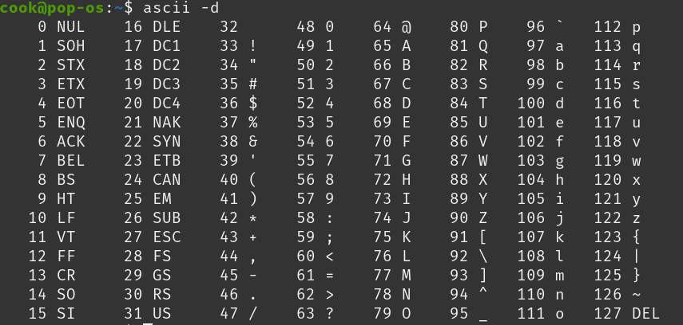

## 참고사항

1. VSC 에서 md 파일 편집 ⇧⌘V in the editor.
2. VSC 에서 프리뷰 (⌘K V)
    - <https://code.visualstudio.com/docs/languages/markdown#_markdown-preview>

## 언어 특징

1. Python 처럼 입력값의 동적인 변수 바인딩은 불가능함. 따라서 slice, map 등의 수동 처리가 필요. (의도된 범주 내에서만 처리)

2. rune 은 하나의 문자를 표현하는 유니코드 포인트. (int32 alias, 4 bytes)

    String 문자열의 한글자는 rune이며, 이를 사람이보기 위한 문자열로 보여주기 위해선 다시 string 형변환이 필요함.

3. 문자열은 불변속성 (immutable) 을 가짐. 따라서 문자열 수정시에는 바이트 배열 관리 혹은 전용 패키지 ( strings ) 기능 활용을 권장함 (아래 활용법에 후술)
## 문법

1. 쿼터 (`) 는 다중 문자열을 출력하는 경우 활용
2. 형 변환 주의

    ```go
    import "strconv" 
    strconv.Itoa(4) // 정수형을 Ascii 변환 (문자 4로). 반대는 strconv.Atoi
    string(4) // 유니코드 포인트 (rune) 을 문자열로. 즉 4가 아닌 유니코드 0004 로 변환되며 이는 제어문자이므로 출력이 안되 에러발생.
    ```

3. fmt.Sprintf 는 Printf 와 달리 출력 없이 문자열로 반환되는 함수. (string print formatted)
4. var a []int 는 고정길이 배열이므로, 다른 변수의 길이로 선언하여 활용할 수 없음.
    이를 위해선 슬라이스 형태로 동적 배열을 활용해야함

    ```go
    tmp := make([]int, n)
    ```

5. 데이터 입력 처리 방식
    - 5-1. bufio.NewScanner 활용 방식

        ```go
        // Scanner 은 한줄 입력값이 최대 64kb, 또한 입력데이터를 활용시에도 한줄한줄 선언해서 처리해야함 
        // 버퍼 사이즈 키우기 위한 방법은 후술함
        var scanner *bufio.Scanner = bufio.NewScanner(os.Stdin)
        var writer *bufio.Writer = bufio.NewWriter(os.Stdout)

        // 상위 함수가 중료되기 전에 동작하도록 하는 예약선언. 로직 마지막에 동작하도록 선언하려는 경우 활용
        // 지금의 경우, 함수 종료 시 입력이 끝났으니 버퍼를 초기화 시키기 위함임
        defer writer.Flush()

        // 첫번째 줄 읽기
        scanner.Scan()
        N, _ := strconv.Atoi(scanner.Text()) // .Text() 한줄 그대로 읽기
        arr := make([]int, N)

        // 두번째 줄 읽기,
        scanner.Scan()
        temp := strings.Fields(scanner.Text()) // 공백 기준으로 string 배열 만들기
        
        for i, v := range temp {
            arr[i], _ = strconv.Atoi(v)
        }
        ```

    - 5-2. Bufio.Reader 를 활용한 처리 (고급 데이터 읽기)

        ```go
        var reader *bufio.Reader = bufio.NewReader(os.Stdin)
        var writer *bufio.Writer = bufio.NewWriter(os.Stdout)

        defer writer.Flush()
        l, err := reader.ReadString('\n')
        if err != nil {
            return // 에러 발생
        }
        l = strings.TrimSpace(l)
        if l == "" {
            return // 입력 없으면 끝내기
        }
        ```

6. 초기값 0이 출력되는거 방지

    ```go
    if _, err := fmt.Fscan(reader, &a, &b); err != nil {
        continue
    }
    ```

7. 언어별 빠른 I/O 처리 방식 (문제 백준 15552)
    <https://docs.google.com/document/d/17OUl9nU9i7vTkhk2q_qy4Q5Vl0HHE9bTLUHwbLp56WM/edit?pli=1&tab=t.0#heading=h.oq3q0ypfd1l2>
8. Fprintln 는 bufio.NewWriter(os.Stdout) 으로 선언해 할당된 변수 값이 실제 출력되는 타이밍.
    단순 콘솔 출력 목적인 println 보다 더 적합하게 활용할 수 있음

9. 패키지를 아래 처럼 단순하게 사용할 수 있음

    ```go
    var pl = fmt.Println
    pl("Hello World!")
    ```

10. 문자열 반복 생성

    ```go
    fmt.Println(strings.Repeat("*", 5)) // *****
    ```

11. Go 1.21 이상부터는 Min, Max 숫자 탐색을 위한 패키지는 Slices 에 존재.
    구버전은 수동 계산식을 작성해야 하며 Math 는 Float 데이터의 1:1 비교만 가능.

12. String 은 여러 rune (bytes) 의 연속된 값을 말함. (그래서 문자"열")
    즉, string 값 꺼내서 하나의 문자로 쓸라면 string() 으로 형변환 필요

13. csv 데이터를 다룰때는 `strings.Split` 사용할 것.
    - `strings.Split` : 지정 구분자로 나뉜 데이터의 빈 문자열을 포함
    - `strings.Fileds` : 지정 구분자로 나눈 데이터의 빈 문자열을 제거.

## 응용
1. bufio.NewScanner 버퍼 사이즈 증가 예시코드

    ```go
    package main

    import (
        "bufio"
        "fmt"
        "os"
        "slices"
        "strconv"
        "strings"
    )
    func main() {
        var scanner *bufio.Scanner = bufio.NewScanner(os.Stdin)
        var writer *bufio.Writer = bufio.NewWriter(os.Stdout)
        defer writer.Flush()

        const maxCap = 10 * 1024 * 1024
        buf := make([]byte, 0 , 64*1024)
        scanner.Buffer(buf, maxCap)
        
        // 입력받은 띄어쓰기 기반 데이터를 각 변수에 바로 할당하는 방법
        scanner.Scan()
        N, _ := strconv.Atoi(scanner.Text())

        scanner.Scan()
        temp := strings.Fields(scanner.Text())

        result := make([]int, N)
        for i, v := range temp {
            a, _ := strconv.Atoi(v)
            result[i] = a

        }
        fmt.Println(slices.Min(result), slices.Max(result))
    }
    ```
2. 문자열 이어붙히기 최적화

    ```go
    // 처리 비용 비싸고 처리 문자열이 길수록 시간 제곱배
    var result string
    for _, v := range s {
        for range r {
            result += string(v) // 문자열 복사 후 새로 쓰기 누적됨
        }
    }
    fmt.Println(result)

    // 조금 더 최적화, 문자열을 효율적으로 이어붙히기 위해 설계된 타입
    // 내부 버퍼에 이어붙힐 데이터를 추가하다가 마지막에 최동 데이터를 반환.
    // []byte 슬라이스에 모았다가 변환해도 비슷한 효과를 누릴 수 있음
    import strings
    var builder strings.Builder
    for _, v := range s {
        for range r {
            builder.WriteRune(v) // rune (한글자) 추가
            //builter.WriteString("ASDASD") // 문자열 추가
        }
    }
    fmt.Fprintln(writer, builder.String()) // 변수할당 없이 빠르게 출력
    result := builder.String() // Builder에 저장된 데이터를 문자열로 변수에 할당
    
    // 제일 빠른 방식, 출력 버퍼에 직접 쓰기. (중간 문자열을 굳이 만들필요가 없을떄)
    for _, v := range s {
        for i := 0; i < r; i++ {
            writer.WriteRune(v)
        }
    }
    writer.WriteByte('\n')
    ```

3. 문자열 뒤집기 함수 만들기

    ```go
    
    func reverseString(s string) string {
        bs := []byte(s)
        for i, j := 0, len(bs)-1; i < j; i, j = i+1, j-1 {
            bs[i], bs[j] = bs[j], bs[i]
        }
        return string(bs)
    }
    // 자동으로 위치 바꿔주네
    ```

4. 참고
    - 아스키 테이블
    